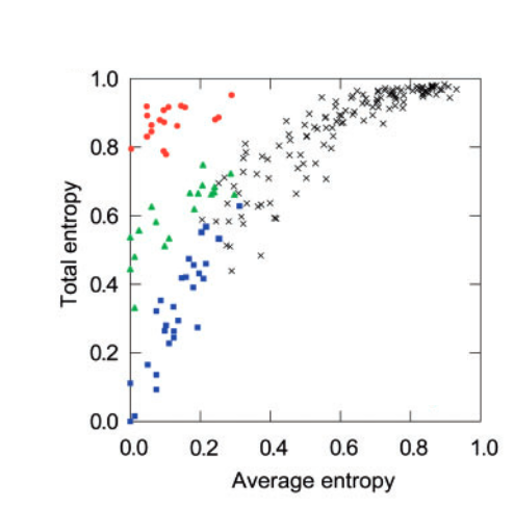
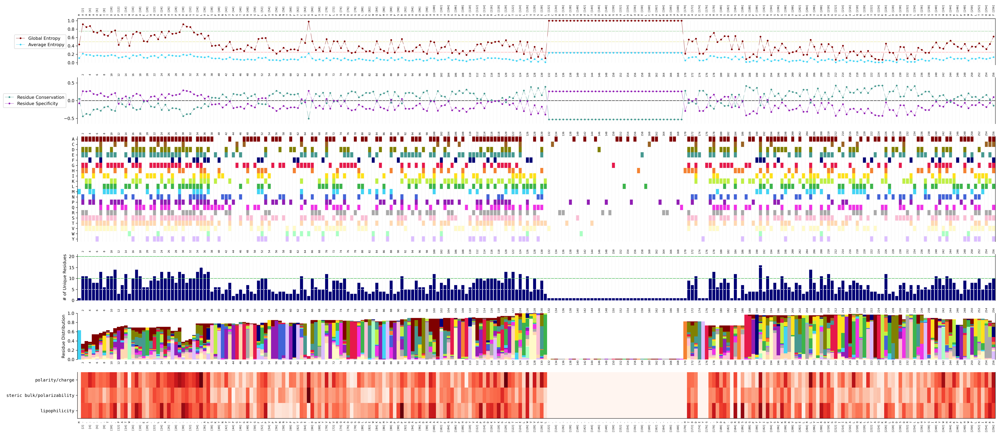

# PyTEA-O

This repository contains a Python implementation of the Two-Entropies Analysis as described in [*Ye et al., 2008*](https://pubmed.ncbi.nlm.nih.gov/18304936/) for protein sequence variation analysis.
<<<<<<< HEAD

# Table of contents

- [Introduction](#introduction)</br>
- [Setup](#setup)</br>
- [Usage](#usage)</br>
- [License](#license)</br>

## Introduction <a name="introduction"></a>

### About protein sequence variation analysis based on a MSA of homologous sequences

Protein sequence variation analysis based on a multiple sequence alignment (MSA) provides evolutionary information to understand how sequence changes relate to protein function. By aligning homologous sequences from different species (or individuals), conserved residues that are critical for structural integrity or catalytic activity can be distinguished from variable regions. Highly conserved positions often indicate essential functional or structural roles. Thus, protein sequence variation analysis can be used to identify functionally relevant residues based on a MSA and prioritize protein variants for experimental study. 

### About Two-Entropies Analysis 

Two-Entropies Analysis (TEA) was first introduced by [*Ye et al.*](https://pubmed.ncbi.nlm.nih.gov/18304936/) in 2008. TEA is a method used to identify residues that account for functional differences among protein subfamilies. It applies Shannon entropy as a measure of sequence conservation, calculating it both across all sequences at a given alignment position (global entropy) and separately within each subfamily, where the values are then averaged. By comparing these two measures, TEA can distinguish residues that are universally conserved from those that are variable yet still functionally important within specific subfamilies.

An example of a figure where the average entropy is plotted versus the global entropy is shown below. The data shown is a synthethic dataset that is described in the original publication. This figure was adapted from the original [*TEA publication*](https://pubmed.ncbi.nlm.nih.gov/18304936/)



Each point in the figure represents a position in the MSA, and its location in the plot provides hints into its functional role:

**Lower left corner**: Positions here are highly conserved (low total entropy). These residues are usually critical for core functions of the protein, such as stability or catalysis.

**Upper left corner**: Positions are conserved within subfamilies (low average entropy) but differ between subfamilies (high total entropy). These are often specificity-determining positions.

**Upper right corner**: Positions show little conservation (both entropies high). These residues are typically less important for protein function.

#### TEA versus TEA-O

In the original Two-Entropies Analysis (TEA), users must manually define protein subfamilies, which can lead to inconsistent or non-reproducible results. To address this limitation, Ye et al. later introduced an objective version of the algorithm (TEA-O), which automatically partitions the sequences into subgroups and then averages the Shannon entropy at each alignment position across these objectively defined groups. This automated procedure removes subjectivity from subgroup selection and results in more reproducible identification of residues linked to functional divergence.

### Why this Python implementation?

The original source code is no longer available, so we re-implemented the method in Python.  
This ensures the approach remains accessible, reproducible, and easy to integrate into modern bioinformatics pipelines


=======

# Table of contents

- [Introduction](#introduction)</br>
- [Setup](#setup)</br>
- [Usage](#usage)</br>
- [License](#license)</br>

## Introduction <a name="introduction"></a>

### About protein sequence variation analysis based on a MSA of homologous sequences

Protein sequence variation analysis based on a multiple sequence alignment (MSA) provides evolutionary information to understand how sequence changes relate to protein function. By aligning homologous sequences from different species (or individuals), conserved residues that are critical for structural integrity or catalytic activity can be distinguished from variable regions. Highly conserved positions often indicate essential functional or structural roles. Thus, protein sequence variation analysis can be used to identify functionally relevant residues based on a MSA and prioritize protein variants for experimental study. 

### About Two-Entropies Analysis 

Two-Entropies Analysis (TEA) was first introduced by [*Ye et al.*](https://pubmed.ncbi.nlm.nih.gov/18304936/) in 2008. TEA is a method used to identify residues that account for functional differences among protein subfamilies. It applies Shannon entropy as a measure of sequence conservation, calculating it both across all sequences at a given alignment position (global entropy) and separately within each subfamily, where the values are then averaged. By comparing these two measures, TEA can distinguish residues that are universally conserved from those that are variable yet still functionally important within specific subfamilies.

An example of a figure where the average entropy is plotted versus the global entropy is shown below. The data shown is a synthethic dataset that is described in the original publication. This figure was adapted from the original [*TEA publication*](https://pubmed.ncbi.nlm.nih.gov/18304936/)


Each point in the figure represents a position in the MSA, and its location in the plot provides hints into its functional role:

**Lower left corner**: Positions here are highly conserved (low total entropy). These residues are usually critical for core functions of the protein, such as stability or catalysis.

**Upper left corner**: Positions are conserved within subfamilies (low average entropy) but differ between subfamilies (high total entropy). These are often specificity-determining positions.

**Upper right corner**: Positions show little conservation (both entropies high). These residues are typically less important for protein function.

#### TEA versus TEA-O

In the original Two-Entropies Analysis (TEA), users must manually define protein subfamilies, which can lead to inconsistent or non-reproducible results. To address this limitation, Ye et al. later introduced an objective version of the algorithm (TEA-O), which automatically partitions the sequences into subgroups and then averages the Shannon entropy at each alignment position across these objectively defined groups. This automated procedure removes subjectivity from subgroup selection and results in more reproducible identification of residues linked to functional divergence.

### Why this Python implementation?

The original source code is no longer available, so we re-implemented the method in Python.  
This ensures the approach remains accessible, reproducible, and easy to integrate into modern bioinformatics pipelines


## Setup <a name="setup"></a>
>>>>>>> 67c4883 (update README and add ubiquitin example)

### Prerequisites
- [Anaconda](https://www.anaconda.com/products/distribution) or [Miniconda](https://docs.conda.io/en/latest/miniconda.html) installed on your system.

### Creating a Conda Environment

1. **Clone the repository**
    ```sh
    git clone https://github.com/CDDLeiden/PyTEA-O.git
    cd PyTEA-O
    ```

2. **Create a new Conda environment**
    ```sh
<<<<<<< HEAD
    conda create -n pyteao python=3.13
=======
    conda env create --file environment.yaml -n TEAO
>>>>>>> 67c4883 (update README and add ubiquitin example)
    ```

3. **Activate the Conda environment and install requirements**
    ```sh
<<<<<<< HEAD
    conda activate pyteao
    pip install -e .
=======
    conda activate TEAO
>>>>>>> 67c4883 (update README and add ubiquitin example)
    ```

4. **(Optional) Deactivate the Conda environment:**
    ```sh
    conda deactivate
    ```

## Usage <a name="usage"></a>

<<<<<<< HEAD
For performing a two-entropies analysis, the only input needed is a MSA in FASTA or CLUSTAL format. To quickly get started, we provided an example MSA in the /example directory. The MSA consists of homologous ubiquitin sequences. Running the TEA calculations using the provided MSA allows you to verify that everything is working as expected.

### Running the TEA(O) calculations

#### Running the TEA-O mode

To run the ubiquitin example in the **TEA-O mode**, run the following:

```bash
python main.py \
    -m example/ubiquitin.fasta.aligned \
    -r KAF8060592
```

Here, the UPGMA algorithm is automatically executed to create the different subgroups

#### Running the TEA mode

To run the program in **TEA mode**, you must provide custom subgroups in a separate file.  
When a **subfamily file** is supplied, the program automatically switches to TEA mode.

An example subfamily file is available at:

    example/ubiquitin.headers

This file is **tab-delimited** and contains three columns:

1. **Node number**  
2. **Distance on the tree** — identical for all accessions within the same subgroup  
3. **Accession numbers** — a comma-separated list of accessions belonging to that subfamily

To run the ubiquitin example in the **TEA mode**, run the following:

```bash
python main.py \
    -m example/ubiquitin.fasta.aligned \
    -r KAF8060592 \
    -s example/ubiquitin.headers
```

Where ```-m``` is the location of the MSA, ```-r``` is the ID of the reference sequence and ```-s``` is the subfamily file 

### Interpreting the results

When the code is executed, several output files are generated. The main visualization can be found in **`figure.png`**, which contains a multi-panel figure summarizing entropy calculations and related characteristics for each alignment position. The example figure below shows the output for our sample MSA.
=======
For performing a TEA, the only input needed is a MSA in FASTA or CLUSTAL format. To quickly get started, we provided an example MSA in the /example directory. The MSA consists of homologous ubiquitin sequences. Running the TEA calculations using the provided MSA allows you to verify that everything is working as expected.

### Running the TEA(O) calculations

First, you can create subgroups using the UPGMA algorithm

```bash
python src/upgma_subfam_grouping.py \
    -m example/ubiquitin.fasta.aligned \
    -o example/results/subfamilies
```

Next, the entropy calculations can be started using

```bash
python src/run_TEA.py \
    -m example/ubiquitin.fasta.aligned \
    -o example/results/SE \
    -r  "KAF8060592" \
    -t 12 \
    -e "TEAO"
    -f example/results/subfamilies/upgma.subfamilies \
    -c config/graph_results.cfg
```

Where ```-r``` is the ID of the reference sequence, ```-t``` is the number of threads to use and ```-f``` is the subfamily file that is created within the ```upgma_subfam_grouping.py```

### Interpreting the results

When the code is executed, several output files are generated. The main visualization can be found in **`shannon_entropy.png`**, which contains a multi-panel figure summarizing entropy calculations and related characteristics for each alignment position. The example figure below shows the output for our sample MSA.
>>>>>>> 67c4883 (update README and add ubiquitin example)



__panel 1: Shannon Entropy values__

This panel compares *global entropy* with *average entropy* across all alignment positions.  
Examining global vs. average entropy can help identify residues that are potentially functionally important.

If you want to plot entropy in other ways, the raw values are available in:  
- `TEA.superfamily_entropy` (global entropy values per residue)  
- `TEA.average_entropy` (average entropy values per residue)

__panel 2: Specificity/conservation scoring__

**Panel 2: Specificity and conservation scores**  
This panel shows conservation and specificity scores for each alignment position. These are calculated as:

`residue_conservation_scores = -sqrt((ase_values)^2 + (se_values)^2) + 0.5`
`residue_specificity_scores = -sqrt((ase_values)^2 + (se_values - 1)^2) + 0.5`

- A **higher conservation score** indicates a position that is strongly conserved across the alignment.  
- A **higher specificity score** suggests that a residue is differentially conserved between protein families, potentially pointing to specificity-determining positions.
 

__panel 3: Residue presence matrix__

Each amino acid is represented by a distinct color, while white indicates absence at a given position.  
This panel makes it easy to spot which residues are present at each alignment position.
<<<<<<< HEAD
=======
The data for this plot is stored in `consensus.logo`.
>>>>>>> 67c4883 (update README and add ubiquitin example)

__panel 4: Residue variants__

This panel reports the total number of different amino acids (out of the 20 natural residues) present at each alignment position.  
High variability suggests low conservation, while low variability indicates strongly conserved residues.  

__panel 5: Residue frequency distribution__

Using the same color scheme as panel 3, this plot shows the frequency of each residue at every alignment position.  
This provides a more detailed view of amino acid distributions.

__panel 6: Z-scale heatmap__

This panel visualizes the standard deviations for Z-scale 1–3, which correspond to:  
1. Lipophilicity  
2. Steric bulk/polarizability  
3. Polarity/charge  

Darker colors indicate greater variability in these properties at a given position.  
<<<<<<< HEAD
More information about Z-scales can be found in [*Sandberg et al., 1998*](https://pubs.acs.org/doi/10.1021/jm9700575).

__changing figure layout__

To modify the figure layout, use the `-l` argument.  
Each digit in the layout string represents whether a subplot is shown (`1`) or hidden (`0`).

For example, to remove the 6th panel, use: `-l 111110`
=======
More information about Z-scales can be found in [*Sandberg et al., 1998*](https://pubs.acs.org/doi/10.1021/jm9700575).  

The individual Z-scores are available in `prot_descriptors_ZscaleSandberg.tsv`.

>>>>>>> 67c4883 (update README and add ubiquitin example)

## License <a name="license"></a>

The software is licensed under the CC-BY-NC, which means it is free to use, remix, and build upon non-commercially as long as the copyright terms of the license are preserved. Commercial use is not permitted. You can view the LICENSE file for the full terms. If you have questions about the license or the use of the software in your organization, please contact Gerard J.P. van Westen at gerard@lacdr.leidenuniv.nl.

